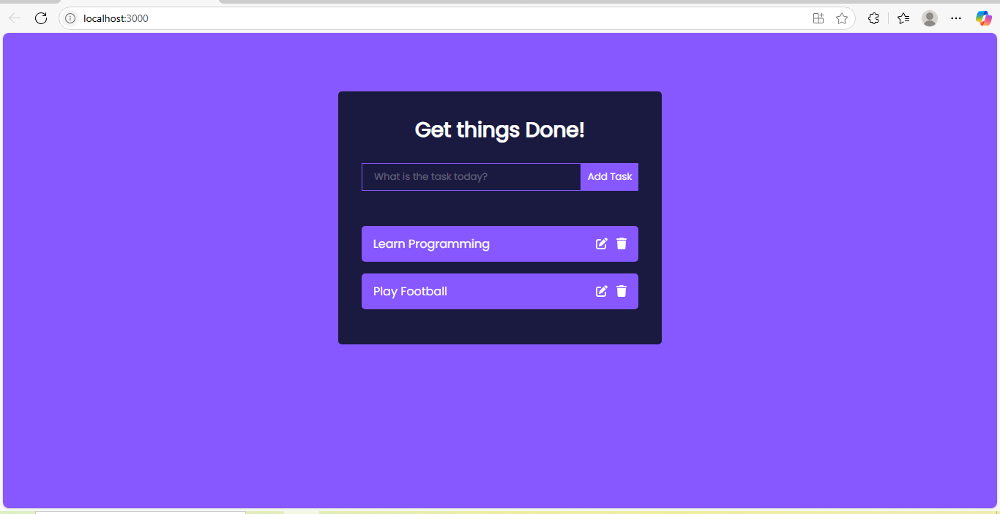

# ✅ React Todo App

A beautiful, responsive, and interactive **Todo List App** built using **React**. This app allows you to add, edit, complete, and delete tasks with ease. Styled with custom CSS and powered by `uuid` and FontAwesome.

---

## 🚀 Features

- 🎯 Add new tasks
- ✅ Mark tasks as completed
- 📝 Edit existing tasks
- 🗑️ Delete tasks
- 💅 Beautiful, responsive UI
- ♿ Accessible input field and icons
- 🔁 Toggle between view and edit modes

---

## 🧰 Technologies Used

- ⚛️ React (Functional Components + Hooks)
- 💅 CSS (Custom styling)
- 🎨 FontAwesome for icons
- 🔑 UUID for unique task IDs

---

"dependencies": {
  "react": "^18.x.x",
  "react-dom": "^18.x.x",
  "uuid": "^9.x.x",
  "@fortawesome/react-fontawesome": "^0.2.x",
  "@fortawesome/free-solid-svg-icons": "^6.x.x"
}
